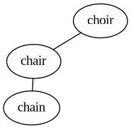
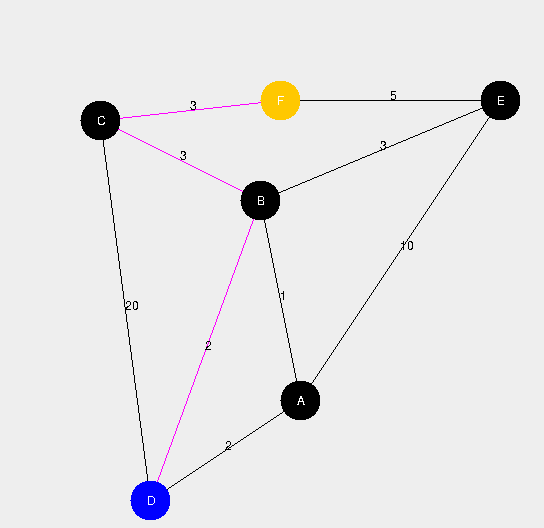

## (Very) Late API Project
---

I chose the fairly straightforward [jgrapht](https://jgrapht.org/) library. The website describes it well, but put very simply it provides some conveniences for programming anything which involves graph structures. This (the one you are reading the readme for) project will consist of two main demos, each of which heavily relies on the JGraphT library. The first shows off a large number of small scale features, while the second integrates it into a larger, cohesive demo.

If you want to actually run the project, you'll have to install the library into a project with the files in src or something like that. If you don't feel like running the project, sample output is included for both parts.

---

### Words and Such

We can't show off how cool a graph library is without a graph. I happened to be helping a friend at the University of Iowa with a problem involving a graph and it happens to serve as a decent demo for a few features of JGraphT. The graph is defined as containing each word in a dictionary as a node, with there being an edge between words if they are one character replacement different. The graph does not contain fake words. We only deal with real words here. None of that "other languages" nonsense, only _American_ here. Pictured is a small snapshot of the graph centered on 'chair'. No other edges connect any of these words further. This is an isolated "island" in the graph.



What fun may be had with this large graph? We can do things like search for the shortest distance between two words (if they're even connected), look for the furthest word from any given word, identify the number of disconnected subgraphs exist and how large they are. Running `WordDemo` does all of these.

Program output in case you don't feel like running it for yourself:
```
Creating graph...
Created graph
---
All words reachable from the word 'chair'
[chain, chair, choir]
---
Shortest path between 'graph' and 'trees'
[graph, grape, gripe, tripe, trips, tries, trees]
---
Furthest word from 'graph'
onset
[graph, grape, gripe, grips, grits, writs, waits, warts, wares, wires, aires, aides, aided, added, adder, adler, idler, idles, isles, islet, inlet, inset, onset]
---
Number of connected sets: 36220
Number of connected sets of each size:
{1=31725, 2=3222, 2242=1, 3395=1, 3=715, 4=230, 5=117, 6=57, 7=35, 135=1, 8=25, 9=11, 10=18, 11=13, 12=4, 141=1, 13=3, 14=6, 2383=1, 15=3, 16=3, 17=1, 18=2, 19=3, 212=1, 20=3, 789=1, 21=1, 22=3, 215=1, 24=2, 25=1, 26=1, 29=1, 223=1, 100=1, 37=1, 38=1, 39=1, 682=1, 368=1}
```

---

### Interactive _Fun_

This next part is simple: run `DijkstraDemo` and you'll see a weighted graph on the screen. Left click sets the starting node and right click sets the destination. JGraphT will run Dijkstra's on the graph and highlight the shortest route. If it doesn't work for you, blame inconsistencies across operating systems and imagine it working.

Screenshot from the program running:




